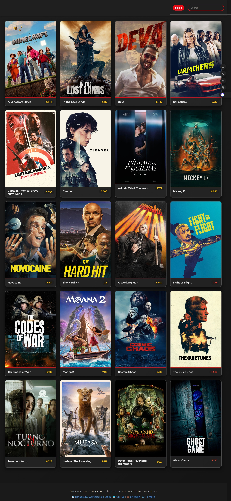

# 🎬 Movie App

Bienvenue dans le projet **Movie App**, une application web interactive permettant de rechercher, consulter et visualiser des **informations sur les films** grâce à l'API **The Movie Database (TMDB)**.  
Elle propose une interface moderne avec **auto-complétion**, une **modale détaillée** avec affiche, description, note, et même **bande-annonce YouTube intégrée**.

---

## 🔗 Démo en ligne

🌐 Application Web : [https://j0yb0y28.github.io/movie-app/](https://j0yb0y28.github.io/movie-app/)  
🧠 API utilisée : [TMDB - the movie database](https://www.themoviedb.org/)

---

## 📁 Structure du projet

```
movie-app/
├── index.html                 # Page principale de l’application
├── script.js                  # Logique JavaScript (recherche, modale, API, auto-complétion)
├── style.css                  # Design général (responsive, dark mode, animations)
├── movie-icon/                # Fichiers favicon & icons de l’app
```

---

## ✨ Fonctionnalités

- 🔍 **Recherche en temps réel** de films avec auto-complétion
- 🧠 Suggestions dynamiques via l’API TMDB
- 🎬 Affichage d'une **fiche détaillée** d’un film en modale :
  - Titre, note, synopsis, date de sortie
  - Bande-annonce YouTube intégrée
- 🌙 Design responsive et élégant
- 🏠 Bouton “Home” pour revenir à la liste des films populaires
- ✅ Fermeture de la modale intuitive (clic extérieur ou bouton X)
- 📱 Compatible mobile et tablette

---

## 🚀 Lancer le projet localement

### 1. Cloner le projet

```bash
git clone https://github.com/J0YB0Y28/movie-app.git
cd movie-app
```

### 2. Ouvrir le fichier `index.html` dans un navigateur

Aucun backend nécessaire, tout fonctionne côté client ✨  
Pas besoin de compilation, ni d’installation.

---

## 🎥 Fonctionnement technique

- Utilisation de l’**API TMDB v3** via `fetch()`
- Modale dynamique créée via JS pur
- Suggestions de titres à chaque frappe (auto-complete)
- Lecture vidéo intégrée via **YouTube embed**

---

## 🙌 Auteur

Projet réalisé par **Teddy Kana**  
📧 Contact : [kanaboumkwoiit@outlook.com](mailto:kanaboumkwoiit@outlook.com)  
🔗 [Portfolio](https://j0yb0y28.github.io/portfolio/) · [GitHub](https://github.com/J0YB0Y28) · [LinkedIn](https://www.linkedin.com/in/teddy-kana-6a26832b9/)

---

## 🛠️ Technologies utilisées

- `HTML5`, `CSS3`, `JavaScript` vanilla
- `TMDB API` (The Movie Database)
- `YouTube Embed API`
- `Flexbox`, `Grid`, `media queries`, `modale CSS`
- Aucun framework nécessaire (léger & rapide ⚡️)

---

## ✅ Possibilités d’améliorations

- [ ] Ajouter un système de favoris (localStorage)
- [ ] Intégrer un mode sombre/clair (toggle UI)
- [ ] Ajouter des filtres (genres, années, popularité)
- [ ] Support multilingue (fr/en)
- [ ] Intégration avec TMDB login pour noter les films

---

## 🖼️ Aperçu de l'interface



---
```

